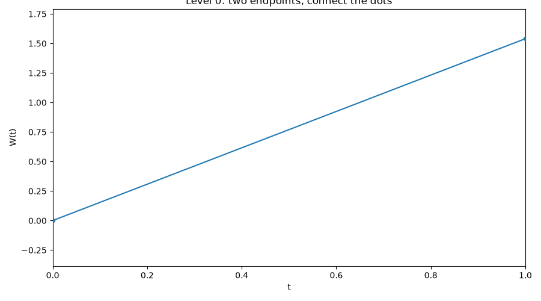

# Part 1: Shifting Gears Again

## From Discrete Time to Continuous Time

In Modules 3–6 we studied **discrete-time** models:

- Observations $X_1, X_2, \ldots, X_n$ sampled at discrete time points (e.g. daily, weekly or monthly returns)
- ARMA and GARCH models
- Everything indexed by an integer $t$

Now we shift to **continuous time**:

- Events at every time stamp (no gaps)
- A price path that moves *continuously*, not once per day
- Models indexed by a real number $t \geq 0$, not an integer

## Why Continuous Time?

Daily closing prices hide everything that happens *during* the day. Some questions can't be answered with daily data at all:

- How wide should a market maker set the bid-ask spread?
- How do I hedge a position in options at every time point
- How often does an order arrive at a given price level?
- How much inventory risk builds up between trades?

These require modeling **when** things happen, not just their once-a-day summary.

## The Case Study for This Part

**Our case study for Part 3:**

**High-frequency market making** — quoting bid and ask prices, managing inventory, and earning the spread while orders arrive continuously and prices jitter tick by tick. We introduce it now and build the tools to analyze it over Modules 7–8.

**A preview:** the same continuous-time toolkit — Poisson processes, Brownian motion, and (soon) Itô's lemma — is also exactly what CS 4 (options pricing, Modules 9–11) needs. Building it carefully now pays off twice.

## Prelude: The Market Maker's Problem

A market maker simultaneously:

- **Quotes** a bid price (buy) and ask price (sell) around the current fair value
- **Earns** the bid-ask spread on each round trip
- **Risks** holding unwanted inventory if the market moves before they can offload it

Two random ingredients drive this problem:

1. **When do orders arrive?** — modeled with a **Poisson process**
2. **How does the fair price move?** — modeled with **Brownian motion**

This module builds both tools from scratch, with CS 3 as the running example. Module 8 uses them for CS 3 directly — and the same building blocks resurface in CS 4, once we add Itô's lemma in Module 9.

# Part 2: The Poisson Process

## Counting Random Arrivals

Let $N(t)$ count the number of events (e.g., buy orders) that have occurred by time $t$, starting from $N(0) = 0$.

$\{N(t)\}_{t \geq 0}$ is a **Poisson process** with rate $\lambda > 0$ if:

1. $N(0) = 0$
2. **Independent increments:** the number of events in disjoint time intervals are independent
3. **Stationary increments:** the distribution of $N(t+s) - N(s)$ doesn't depend on $s$
4. $N(t+h) - N(t) \sim \text{Poisson}(\lambda h)$ for any $h > 0$

$\lambda$ is the **arrival rate** — the expected number of events per unit time.

## Key Properties

**Expectation and variance:**
$$
E[N(t)] = \lambda t, \qquad \text{Var}(N(t)) = \lambda t
$$

**Interarrival times:** the gaps between consecutive events, $T_1, T_2, \ldots$, are IID:
$$
T_i \sim \text{Exponential}(\lambda), \qquad E[T_i] = \frac{1}{\lambda}
$$

**Memorylessness:** given that we've waited $s$ time units for the next event with no arrival yet, the *additional* waiting time is still $\text{Exponential}(\lambda)$ — the process has no memory of how long you've already waited.

This is an assumption that may not hold in practice, but is still useful.

## Simulating a Poisson Process

In principle you could draw $N(t)$ directly from $\text{Poisson}(\lambda t)$ for any fixed $t$ — but that only gives you the *count*, not the full path, and you can't get the path by drawing a Poisson count at every $t$ since there are uncountably many of them.

Instead, we simulate the path exactly: draw exponential interarrival times and cumulatively sum them to get each arrival time.

```{python}
#| label: module07-poisson-sim
#| eval: true
#| output-location: slide
import numpy as np
import matplotlib.pyplot as plt

np.random.seed(5005)
lam = 2.0       # arrival rate, events per unit time
T_max = 20.0    # simulate up to this time

interarrival = np.random.exponential(scale=1 / lam, size=200)
arrival_times = np.cumsum(interarrival)
arrival_times = arrival_times[arrival_times <= T_max]

t_grid = np.concatenate(([0], arrival_times, [T_max]))
N_grid = np.concatenate(([0], np.arange(1, len(arrival_times) + 1), [len(arrival_times)]))

fig, ax = plt.subplots(figsize=(10, 4))
ax.step(t_grid, N_grid, where="post", color="C0")
ax.scatter(arrival_times, np.arange(1, len(arrival_times) + 1), color="C0", s=15, zorder=5)
ax.set_title(fr"Simulated Poisson Process, $\lambda={lam}$")
ax.set_xlabel("t")
ax.set_ylabel("N(t)")
plt.tight_layout()
plt.show()
```

$N(t)$ is a step function: it jumps by 1 at each random arrival time and is flat in between.

## The Arrival Times Themselves

The step function above is really just a running count of the dots below — the arrival times $T_1, T_2, T_3, \ldots$ plotted directly on the timeline:

```{python}
#| label: module07-poisson-arrivals
#| eval: true
#| output-location: slide
import numpy as np
import matplotlib.pyplot as plt

np.random.seed(5005)
lam = 2.0
T_max = 20.0

interarrival = np.random.exponential(scale=1 / lam, size=200)
arrival_times = np.cumsum(interarrival)
arrival_times = arrival_times[arrival_times <= T_max]

fig, ax = plt.subplots(figsize=(10, 2.5))
ax.eventplot(arrival_times, lineoffsets=0, linelengths=0.8, color="C0")
ax.set_xlim(0, T_max)
ax.set_yticks([])
ax.set_xlabel("t")
ax.set_title(fr"Arrival Times, $\lambda={lam}$")
plt.tight_layout()
plt.show()
```

Notice the gaps between consecutive ticks aren't equal — some events arrive in quick succession, others after a long quiet stretch. Those gaps are exactly the $\text{Exponential}(\lambda)$ interarrival times $T_i$ from the previous slide.

## Checking $E[N(t)] = \lambda t$

Simulate many independent paths and compare the average count at each time to the theoretical line $\lambda t$:

```{python}
#| label: module07-poisson-mean-check
#| eval: true
#| output-location: slide
import numpy as np
import matplotlib.pyplot as plt

np.random.seed(5005)
lam = 2.0
T_max = 20.0
n_paths = 500
t_eval = np.linspace(0, T_max, 200)

counts = np.zeros((n_paths, len(t_eval)))
for i in range(n_paths):
    interarrival = np.random.exponential(scale=1 / lam, size=200)
    arrival_times = np.cumsum(interarrival)
    counts[i] = np.searchsorted(arrival_times, t_eval, side="right")

fig, ax = plt.subplots(figsize=(9, 5))
for i in range(30):
    ax.plot(t_eval, counts[i], color="C0", alpha=0.15, lw=1)
ax.plot(t_eval, counts.mean(axis=0), color="red", lw=2, label="Average across 500 paths")
ax.plot(t_eval, lam * t_eval, color="black", ls="--", lw=1.5, label=r"Theoretical $E[N(t)]=\lambda t$")
ax.set_title(f"Poisson Process: Simulated Mean vs. Theory (λ={lam})")
ax.set_xlabel("t")
ax.set_ylabel("N(t)")
ax.legend()
plt.tight_layout()
plt.show()
```

The empirical average (red) tracks the theoretical line $\lambda t$ (dashed black) closely.

## Order Flow as a Poisson Process

In market microstructure, a common starting assumption: buy orders and sell orders each arrive as independent Poisson processes with their own rates $\lambda_{\text{buy}}, \lambda_{\text{sell}}$.

- Higher $\lambda$ near the current fair price, lower $\lambda$ further away — orders cluster near the touch.
- A market maker's fill rate depends on how far their quote sits from fair value: post further away, fewer fills but each is more profitable.

We'll use exactly this assumption to build a simple market-making model in Module 8, following Avellaneda & Stoikov (2008).

## Real Order Flow: SPY Trades, 2026-04-01

`scripts/20260401.txt` is a full day of raw SPY market data — 1.78M timestamped lines. Most are quote (bid/ask) updates, but 746,266 of them are **trade prints** (`last=`), each with a microsecond timestamp:

```
MarketData(ticker=SPY, time=2026-04-01 09:04:35.122803, last=652.58, size=100, exchange=BATS)
```

We'll pull out just the trade timestamps and treat them as arrivals of a counting process $N(t)$ — exactly like the simulated Poisson process above, but real.

```{python}
#| label: module07-real-parse
#| eval: true
#| output-location: fragment
import numpy as np
import pandas as pd

times = []
with open("../../scripts/20260401.txt") as f:
    for line in f:
        if "last=" not in line:
            continue
        i = line.index("time=") + 5
        j = line.index(",", i)
        times.append(line[i:j])

ts = pd.to_datetime(times)
secs = np.sort((ts - ts.normalize()).total_seconds().to_numpy())
t = secs - secs[0]              # seconds since first trade
n = len(t)
lam_hat = n / t[-1]             # trades per second, averaged over the day

print(f"{n:,} trades over {t[-1]/3600:.2f} hours; "
      f"average rate lambda_hat = {lam_hat:.2f} trades/sec")
```

## Cumulative Trade Count vs. $\lambda t$

```{python}
#| label: module07-real-cumcount
#| eval: true
#| output-location: slide
import matplotlib.pyplot as plt
import matplotlib.dates as mdates

counts = np.arange(1, n + 1)
step = 200  # subsample for a fast, still-smooth plot
clock = pd.to_datetime(ts).sort_values()  # wall-clock time for each trade
market_open = clock[0].normalize() + pd.Timedelta(hours=9, minutes=30)

fig, ax = plt.subplots(figsize=(10, 4.5))
ax.plot(clock[::step], counts[::step], color="C0", lw=1.3, label="Real cumulative trade count $N(t)$")
ax.plot(clock, lam_hat * t, color="black", ls="--", lw=1.5, label=r"Fitted $\hat\lambda t$ (constant-rate Poisson)")
ax.axvline(market_open, color="red", ls=":", lw=1.5, label="9:30 market open")
ax.xaxis.set_major_formatter(mdates.DateFormatter("%H:%M"))
ax.set_xlabel("time of day")
ax.set_ylabel("N(t)")
ax.set_title("SPY Trade Arrivals, 2026-04-01")
ax.legend()
plt.tight_layout()
plt.show()
```

Unlike the simulated path, this isn't close to a straight line: it's flat before the 9:30 open (dotted red line), steep right at the open, flatter over midday, then steep again near the close. **The constant-rate assumption is violated** — real order flow rate depends on time of day, exactly the U-shaped intraday volume pattern well documented in market microstructure.

## Zooming In: Bursty Arrivals

```{python}
#| label: module07-real-zoom
#| eval: true
#| output-location: slide
mask = (t > 150 * 60) & (t < 150 * 60 + 2)
tw = t[mask]

fig, ax = plt.subplots(figsize=(10, 2.5))
ax.eventplot(tw, lineoffsets=0, linelengths=0.8, color="C0")
ax.set_xlabel("t (seconds since first trade)")
ax.set_yticks([])
ax.set_title(f"{len(tw)} trades in a 2-second window")
plt.tight_layout()
plt.show()
```

Zoomed in, arrivals aren't spread out evenly like the simulated example either — they come in **tight bursts** (the same trade often prints to multiple exchanges within microseconds of each other), separated by quieter gaps.

This is a form of clustering the simple Poisson model doesn't capture. **FYI: this is a very inexpensive data feed,** but even a good one would show bursty behavior.

## Counts per Second: Poisson vs. Reality

If $N(t)$ were really a constant-rate Poisson process, the number of trades in each one-second window should be roughly $\text{Poisson}(\hat\lambda)$ — with **mean equal to variance**.

```{python}
#| label: module07-real-overdispersion
#| eval: true
#| output-location: slide
from scipy import stats

bins = np.floor(t).astype(int)
counts_per_sec = np.bincount(bins)

# restrict to the regular trading session (skip the thin pre-market open/close edges)
session = counts_per_sec[(30 * 60 < np.arange(len(counts_per_sec))) & (np.arange(len(counts_per_sec)) < 390 * 60)]

print(f"mean = {session.mean():.1f}, variance = {session.var():.1f}")

fig, ax = plt.subplots(figsize=(9, 5))
max_c = int(np.percentile(session, 99.5))
edges = np.arange(0, max_c + 2)
ax.hist(session, bins=edges, density=True, color="C0", alpha=0.6, label="Empirical trades/second")
k = np.arange(0, max_c + 2)
ax.plot(k, stats.poisson.pmf(k, session.mean()), color="black", lw=1.5, label="Poisson pmf (matched mean)")
ax.set_xlabel("trades in a 1-second window")
ax.legend()
plt.tight_layout()
plt.show()
```

Variance is roughly **50x** the mean, not equal to it — real order flow is far more **overdispersed** than a Poisson process allows. The Poisson assumption is a useful starting point (it's what makes Module 8's market-making model tractable), but real data shows its limits: rates vary over the day and arrivals cluster in bursts.

# Part 3: Brownian Motion

## From Random Walk to Brownian Motion

Recall the discrete-time random walk $S_n = \sum_{i=1}^n Z_i$ with $\{Z_i\} \sim \text{IID}(0, \sigma^2)$.

**Brownian motion** $\{W(t)\}_{t \geq 0}$ is the continuous time analog. It's what you get by taking that random walk, shrinking the step size, and speeding up the clock — all at once, in a precise way:

- Split $[0, t]$ into $n$ steps of size $t/n$
- Take IID steps with variance $t/n$ (so total variance stays $t$)
- Let $n \to \infty$

The limit is a process with **continuous paths** but that is **nowhere differentiable** — it wiggles infinitely much at every scale.

## Watching It Get Rough: The Lévy Construction

Another way to build Brownian motion: start with just the two endpoints, connect the dots, then repeatedly fill in the midpoint of every segment with a random displacement — each new generation of midpoints uses a smaller displacement, so the path gets rougher at a finer and finer scale but never overshoots by much:

{fig-align="center" width="70%"}

Each frame doubles the number of known points. Given the endpoints $W(a)$ and $W(b)$ of a segment, the midpoint $W\left(\frac{a+b}{2}\right)$ is Normal with mean $\frac{W(a)+W(b)}{2}$ (the straight-line average) and variance $\frac{b-a}{4}$ — a **Brownian bridge** midpoint. Repeating this forever and connecting the dots at every level converges to a genuine Brownian path: continuous, but rough at every scale.

## Definition

$\{W(t)\}_{t \geq 0}$ is a (standard) **Brownian motion** if:

1. $W(0) = 0$
2. **Independent increments:** $W(t) - W(s)$ is independent of $\{W(u) : u \leq s\}$ for $s < t$
3. **Stationary, Normal increments:** $W(t) - W(s) \sim N(0, t-s)$ for $s < t$
4. Continuous sample paths (as a function of $t$)

**Key contrast with the Poisson process:** both have independent, stationary increments, but Poisson increments are integer-valued jumps while Brownian increments are continuous and Normal.

## Key Properties

$$
E[W(t)] = 0, \qquad \text{Var}(W(t)) = t, \qquad \text{Cov}(W(s), W(t)) = \min(s, t)
$$

- Variance **grows linearly** in $t$ — uncertainty about the level compounds over time.
- Despite being continuous, the paths are so jagged that the usual notion of "speed" (derivative) doesn't exist anywhere.
- Brownian motion is the continuous-time analogue of white noise's cumulative sum (a random walk) — it plays the same foundational role in continuous time that the random walk plays in discrete time.

## Simulating Brownian Motion

Approximate a continuous path with a fine discrete grid: $n$ steps of size $\Delta t = T/n$, each Normal with variance $\Delta t$.

```{python}
#| label: module07-bm-sim
#| eval: true
#| output-location: slide
import numpy as np
import matplotlib.pyplot as plt

np.random.seed(5005)
T = 1.0
n = 1000
dt = T / n
t_grid = np.linspace(0, T, n + 1)

n_paths = 5
increments = np.random.normal(scale=np.sqrt(dt), size=(n_paths, n))
W = np.concatenate([np.zeros((n_paths, 1)), np.cumsum(increments, axis=1)], axis=1)

fig, ax = plt.subplots(figsize=(10, 5))
for i in range(n_paths):
    ax.plot(t_grid, W[i], lw=1, label=f"Path {i+1}")
ax.axhline(0, color="black", lw=0.8, ls="--")
ax.set_title("Simulated Brownian Motion Paths")
ax.set_xlabel("t")
ax.set_ylabel("W(t)")
ax.legend()
plt.tight_layout()
plt.show()
```

Every path starts at 0, and no two paths look alike — but all share the same variance-growth behavior.

## Checking $\text{Var}(W(t)) = t$

```{python}
#| label: module07-bm-var-check
#| eval: true
#| output-location: slide
import numpy as np
import matplotlib.pyplot as plt

np.random.seed(5005)
T = 1.0
n = 1000
dt = T / n
t_grid = np.linspace(0, T, n + 1)
n_paths = 2000

increments = np.random.normal(scale=np.sqrt(dt), size=(n_paths, n))
W = np.concatenate([np.zeros((n_paths, 1)), np.cumsum(increments, axis=1)], axis=1)

empirical_var = W.var(axis=0)

fig, ax = plt.subplots(figsize=(9, 5))
ax.plot(t_grid, empirical_var, color="C0", lw=1.5, label="Empirical Var(W(t)), 2000 paths")
ax.plot(t_grid, t_grid, color="black", ls="--", lw=1.5, label=r"Theoretical Var(W(t)) $= t$")
ax.set_title("Brownian Motion: Simulated Variance vs. Theory")
ax.set_xlabel("t")
ax.set_ylabel("Var(W(t))")
ax.legend()
plt.tight_layout()
plt.show()
```

The empirical variance across 2,000 simulated paths tracks the $45°$ line $\text{Var}(W(t)) = t$ almost exactly.

## Brownian Motion with Drift and Scale

The building block above is *standard* Brownian motion. A more general model for a price-like process adds a drift $\mu$ and volatility $\sigma$:

$$
X(t) = X(0) + \mu t + \sigma W(t)
$$

- $E[X(t)] = X(0) + \mu t$ — a deterministic linear trend
- $\text{Var}(X(t)) = \sigma^2 t$ — uncertainty still grows linearly in $t$

This is the continuous-time analogue of a random walk with drift, and it's the model we'll use for the fair-value price process in the market-making case study.

# Part 4: Looking Ahead to CS 3

## Two Building Blocks, One Model

A simple high-frequency market-making model combines exactly the two processes from this module:

- **Fair value** $X(t)$: a Brownian motion (with drift), moving continuously
- **Order arrivals**: Poisson processes for buys and sells, with rates that depend on how far the market maker's quotes sit from $X(t)$

Module 8 covers the market microstructure — exchange rules, priority, rebates, and data — that these two random processes actually operate inside of for CS 3.

**And beyond CS 3:** Brownian motion with drift is also the process underlying the Black-Scholes model in CS 4. Once we add martingale theory and Itô's lemma (Module 9), the same $X(t) = X(0) + \mu t + \sigma W(t)$ from this module becomes the engine behind option pricing.

## What We Learned: Module 7 Summary

| Concept | Role |
|---|---|
| Poisson process | Models *when* discrete events (orders) happen |
| Interarrival times | Exponential, memoryless — no dependence on elapsed waiting time |
| Brownian motion | Models *continuous* price movement |
| Independent, stationary increments | The shared structural property linking both processes |

Both processes generalize a discrete-time idea we already know: the Poisson process is a continuous-time counting process, and Brownian motion is a continuous-time random walk.

## Looking Ahead: Module 8

Next module: **U.S. equity market structure** — exchanges, price-time priority, maker-taker rebates, payment for order flow, and market data — the institutional plumbing behind the order arrivals and fills we've been modeling, and the background CS 3 assumes.

Module 9 then picks the math back up with **martingales and Itô's lemma**, the tools for reasoning about *fair games* in continuous time, which feed directly into the Black-Scholes derivation for CS 4.

## References

- Avellaneda, M. & Stoikov, S. (2008). *High-frequency trading in a limit order book*. Quantitative Finance, 8(3), 217–224.
